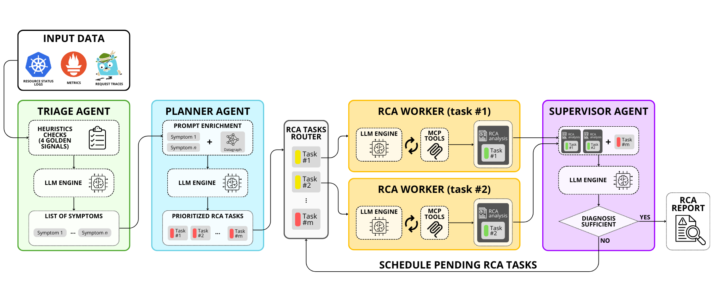

# Agent-Based SRE: Automated Diagnosis and Mitigation in K8s

**sre-agent** is an autonomous multi-agent system designed to automate Incident Response in Kubernetes environments. By leveraging Large Language Models (LLMs) and a **Divide & Conquer** strategy, it significantly reduces the Mean Time to Resolution (MTTR) for complex microservice faults.

This system integrates with **AIOpsLab** for realistic fault injection and uses a custom **Model Context Protocol (MCP)** server to interface with observability tools (Prometheus, Jaeger, Kubernetes API) securely and efficiently.

## 📁 Repository Structure

```
SRE-agent/
├── sre-agent/          # 🧠 Main Multi-Agent System implementation (LangGraph)
├── MCP-server/         # 🔌 Custom Model Context Protocol server for 
├── notebooks/          # 📓 Jupyter notebooks for analysis and development
├── Results/            # 📊 Experiment outputs, logs, and reports
├── archive/            # 📦 Archive of previous project iterations
└── assets/             # 🖼️ Diagrams and static assets
```

## 🤖 SRE Agent Architecture

The agent implements a parallel multi-agent workflow to diagnose faults efficiently:



### Core Components

1.  **🔍 Triage Agent (Hybrid)**
    *   **Role**: Detects symptoms explicitly.
    *   **Method**: Combines **deterministic heuristics** (based on the Four Golden Signals: Latency, Errors, Saturation) with LLM reasoning. This hybrid approach grounds the diagnosis in hard evidence to minimize hallucinations.

2.  **📋 Planner Agent (Topology-Aware)**
    *   **Role**: Strategies the investigation.
    *   **Method**: Uses a **Graph-Based Datagraph** to understand cluster topology (dependencies, upstream services). It generates a deduplicated, prioritized list of **RCA Tasks**, assigning specific investigation goals and target resources.

3.  **🔬 RCA Workers (Parallel Execution)**
    *   **Role**: Execute the investigation.
    *   **Method**: **Divide & Conquer**. Multiple workers run in **parallel**, each handling a specific task. They use MCP tools (Logs, Traces, Metrics) to gather evidence and produce a diagnostic report. A deterministic **RCA Router** manages task dispatching.

4.  **👔 Supervisor Agent**
    *   **Role**: Final Decision Maker.
    *   **Method**: Aggregates worker reports to synthesize a final Root Cause Analysis. It can either finalize the diagnosis or trigger a feedback loop to schedule pending tasks if more evidence is needed.

### Key Features

*   **Datagraph**: A graph representation of the cluster topology (Infrastructure & Data dependencies) that guides the agent, preventing irrelevant resource exploration.
*   **Custom MCP Server**: Standardizes tool interaction and performs "pre-digestion" of data (e.g., retrieving only relevant metrics or error logs) to optimize context window usage and reduce token costs.

---

## 🧪 Automated Evaluation Pipeline

The repository includes a robust pipeline for automated experimentation and benchmarking.

### Framework
*   **Integration**: Built on top of **AIOpsLab** to deploy testbeds (Hotel Reservation, Social Network) and inject realistic faults (Network delays, Pod failures, Misconfigurations).
*   **Batch Execution**: `automated_experiment.py` orchestrates end-to-end batch runs: Cluster Setup → Fault Injection → Agent Execution → Evaluation → Cleanup.

### Metrics
The system is evaluated on:
1.  **Detection Accuracy**: Correct identification of an anomaly.
2.  **Localization Accuracy**: Correct identification of the root cause resource (Service/Pod).
3.  **RCA Score**: Semantic evaluation of the diagnosis using **LLM-as-a-Judge** (1-5 scale with rationale).

---

## 🛠️ Setup & Usage

### Prerequisites
*   **Python 3.13+** & **Poetry**
*   **Docker** & **Kind** (Kubernetes in Docker)
*   **Make** (for AIOpsLab commands)
*   **OpenAI API Key** (for GPT-5-mini)

### Installation

```bash
# Clone the repository
git clone https://github.com/martinimarcello00/SRE-agent.git
cd SRE-agent

# Install dependencies
poetry install

# Configure environment
cp .env.example .env
# Edit .env and add your API keys:
# nano .env
```

### Running the Agent

You can run the agent interactively via LangGraph Studio or as a script.

**Option A: LangGraph Studio (Recommended for Dev)**
```bash
cd sre-agent
poetry run langgraph dev
```

**Option B: Python Script**
```bash
# Run a specific experiment scenario
python sre-agent/sre-agent.py
```

### Running Automated Experiments

To execute a batch of experiments defined in your configuration:

```bash
# Ensure your .env file is configured
# python automated_experiment.py
```
This script will sequentially provision the cluster, inject faults, run the agent, and save the results in `Results/`.
