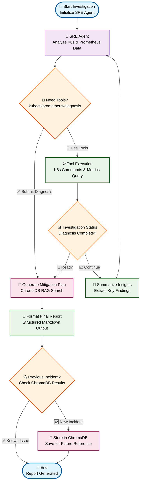

# 🚀 Agent-Based SRE: Automated Diagnosis and Mitigation in K8s

**Autonomous agent for Kubernetes incident detection, diagnosis, and mitigation using LLMs and modular workflows.**

Integrates LangChain, LangGraph, and Model Context Protocol (MCP) to enable automated Site Reliability Engineering tasks in cloud-native environments. The agent uses a **ReAct pattern** (Reason + Act) to autonomously investigate Kubernetes cluster issues and provide diagnostic reports.

## 📁 Project Structure

```
SRE-agent/
├── 📓 SRE-ReAct-agent.ipynb                    # Baseline & structured schema agents
├── 📓 SRE-ReAct-agent-mitigation-plan.ipynb   # Mitigation planning workflow
├── 📓 SRE-ReAct-agent-fetch-prev-incidents.ipynb # RAG-enabled incident retrieval
├── 📋 pyproject.toml                          # Poetry dependencies & configuration
├── 🔧 .env                                   # Environment variables (create from template)
├── 📁 studio/
│   ├── 🐍 react_sre_strctured.py             # LangGraph structured schema implementation
│   ├── 🐍 react_sre_strctured_mitigation.py  # LangGraph mitigation plan implementation
│   └── 📋 langgraph.json                     # LangGraph Studio configuration
├── 📁 results/                               # Generated investigation reports
│   ├── 📄 2025-08-28_11-09-15.md            # Example timestamped report
│   └── 📄 ...                               # Additional investigation outputs
├── 📊 report.pdf                            # PDF report explaining the detailed implementation
└── 📄 README.md
```

## 🏗️ Architecture Overview (Agent with mitigation plan)



### Key Components

- **🧠 LLM Agents**: GPT-5-mini for reasoning and decision-making
- **🔧 MCP Client**: Provides kubectl, Prometheus and ChromaDb tools to the LLM through Model Context Protocol
- **📊 LangGraph**: Orchestrates the investigation workflow with state management
- **🔍 ReAct Loop**: Agent → Tools → Agent cycle until diagnosis is complete
- **☸️ Kubernetes Integration**: Direct cluster access via MCP server
- **📝 Structured Output**: Token-efficient state management and reporting

## 🛠️ Features

### 🔍 Investigation Capabilities
- **Autonomous Cluster Analysis**: Automatically examines deployments, pods, services, and logs
- **Root Cause Detection**: Identifies issues without human intervention
- **Structured Reporting**: Generates detailed diagnostic reports with mitigation plans
- **Token Optimization**: Multiple approaches to reduce LLM token usage

### 📊 Workflow Variants
1. **Baseline ReAct Agent**: Full message history approach
2. **Reduced Context Agent**: Limited message window for efficiency
3. **Structured Schema Agent**: Token-optimized with structured state management
4. **Mitigation Plan Agent**: Extended workflow with automated remediation planning
5. **Mitigation Plan Agent with RAG**: Extended workflow with incident retrieval and automated remediation planning

## 🚀 Quick Start

### Prerequisites

- **Python 3.13+**
- **Node.js** (for MCP server)
- **Kubernetes cluster** (local or remote)
- **kubectl** configured and accessible

### 1. Environment Setup

Create a `.env` file in the project root:

```env
# OpenAI API (required for GPT models)
OPENAI_API_KEY=your_openai_api_key_here

# Google AI Studio API (optional, for Gemini)
GOOGLEAI_API_KEY=your_google_ai_api_key_here

# LangSmith (optional, for tracing and debugging)
LANGCHAIN_TRACING_V2=true
LANGCHAIN_API_KEY=your_langsmith_api_key_here
LANGCHAIN_PROJECT=sre-agent

# ChromaDB storage path
CHROMADB_STORAGE_PATH=/path/to/your/chromadb/storage

# Prometheus server URL (if using Prometheus monitoring)
PROMETHEUS_SERVER_URL=http://localhost:9090

# Results output path
RESULTS_PATH=/path/to/your/results/folder
```

### 2. Install Dependencies

```bash
# Install Poetry if you haven't already
curl -sSL https://install.python-poetry.org | python3 -

# Install Python dependencies with Poetry
poetry install
```

### 3. Activate Poetry Environment

```bash
# Activate the Poetry virtual environment
poetry shell

# Or run commands with Poetry prefix
poetry run jupyter notebook
```

### 4. Run with LangGraph Studio

For visual workflow debugging and development:

```bash
# Install LangGraph CLI
pip install langgraph-cli

# Start LangGraph Studio
langgraph up --config studio/langgraph.json
```

Access the studio at `http://localhost:8123` to:
- 🎨 Visualize workflow graphs
- 🐛 Debug agent execution
- 📊 Monitor token usage
- 🔧 Test different configurations

## 📋 API Keys & Configuration

### Required APIs

| Service | Purpose | Required | Notes |
|---------|---------|----------|-------|
| **OpenAI** | GPT-5/GPT-5-mini models | ✅ Yes | Primary reasoning engine |
| **Google AI Studio** | Gemini 2.5 Flash | ⚪ Optional | Alternative LLM option |
| **LangSmith** | Tracing & debugging | ⚪ Optional | Agent execution monitoring |

### Obtaining API Keys

#### OpenAI API Key
1. Visit [OpenAI Platform](https://platform.openai.com/)
2. Sign up or log in
3. Navigate to API Keys section
4. Create new secret key
5. Add to `.env` as `OPENAI_API_KEY`

#### Google AI Studio Key (Optional)
1. Visit [Google AI Studio](https://aistudio.google.com/)
2. Sign in with Google account
3. Get API key from the interface
4. Add to `.env` as `GOOGLEAI_API_KEY`

#### LangSmith API Key (Optional)
1. Visit [LangSmith](https://www.langchain.com/langsmith)
2. Sign up or log in to your LangChain account
3. Navigate to Settings → API Keys
4. Create a new API key
5. Add to `.env` as:
   - `LANGCHAIN_API_KEY=your_langsmith_api_key_here`
   - `LANGCHAIN_TRACING_V2=true`
   - `LANGCHAIN_PROJECT=sre-agent` (or your preferred project name)

**🔍 LangSmith Benefits:**
- **Trace Visualization**: See complete agent execution flows
- **Debug Tool Calls**: Monitor kubectl command executions
- **Performance Analytics**: Track token usage and execution times
- **Error Analysis**: Investigate failed investigations
- **A/B Testing**: Compare different agent approaches

**⚠️ Disable Tracking:** To run without LangSmith tracking, set:
```env
LANGCHAIN_TRACING_V2=false
```


## 🎮 LangGraph Studio Integration

The project includes LangGraph Studio configuration for visual development:

### Studio Configuration (`studio/langgraph.json`)
```json
{
    "graphs": {
      "react_structured_schema": "./react_sre_strctured.py:graph",
      "react_mitigation_plan": "./react_sre_strctured_mitigation.py:graph"
    },
    "env": "./.env",
    "python_version": "3.13"
}
```

### Available Graphs in Studio

1. **`react_structured_schema`**: Token-optimized investigation workflow
2. **`react_mitigation_plan`**: Full investigation + mitigation planning

## 📊 Workflow Approaches

### 1. Baseline ReAct Agent
- **Context**: Full message history
- **Pros**: Complete context awareness
- **Cons**: High token usage

### 2. Reduced Context Agent
- **Context**: Last 7 messages only
- **Pros**: Balanced efficiency and context
- **Cons**: May lose important historical context

### 3. Structured Schema Agent 
- **Context**: Structured state with insights/steps
- **Pros**: Minimal token usage, maintains key information
- **Cons**: Slight complexity in state management

### 4. Mitigation Plan Agent
- **Context**: Structured + remediation planning
- **Pros**: Complete SRE workflow
- **Cons**: Highest complexity

### 5. Mitigation Plan Agent with RAG
- **Context**: Structured + incident retrieval + remediation planning
- **Features**: 
  - Queries ChromaDB for similar previous incidents
  - Reuses proven mitigation strategies when applicable
  - Stores new incidents automatically for future reference
  - Marks incidents as "already happened" when found in knowledge base
- **Pros**: Complete SRE workflow with information retrieval
- **Cons**: High token usage


## 📈 Results & Output

### Generated Reports Include:
- 🔍 **Investigation Steps**: Detailed action log
- 💡 **Key Insights**: Important findings during analysis  
- 🚨 **Root Cause Analysis**: Identified issues and reasoning
- 🛠️ **Mitigation Plans**: Step-by-step remediation (in extended version)

### Output Formats:
- **Console**: Real-time progress and results
- **Text Files**: Timestamped investigation logs (`results/` folder)
- **Markdown**: Formatted reports with structure (mitigation agent)

## 🙏 Acknowledgments

### Academic Context
This project was developed as part of the **Multidisciplinary Project** course at **Politecnico di Milano**, supervised by:
- **Dr. Matteo Ferroni**
- **Prof. Marco Domenico Santambrogio**

### Open Source Projects
- [**Microsoft AIOpsLab**](https://github.com/microsoft/AIOpsLab): Testbed creation and fault injection framework for chaos engineering
- [**LangChain & LangGraph**](https://github.com/langchain-ai): Workflow orchestration and agent framework
- [**Poetry (Python Package Manager)**](https://github.com/python-poetry/poetry): A tool for dependency management and packaging in Python.

### MCP (Model Context Protocol) Servers
- **[mcp-server-kubernetes](https://github.com/Flux159/mcp-server-kubernetes)**: Kubernetes cluster interaction via kubectl
- **[chroma-mcp](https://github.com/chroma-core/chroma-mcp)**: ChromaDB vector database integration for RAG
- **[prometheus-mcp](https://github.com/idanfishman/prometheus-mcp)**: Prometheus metrics server integration
