# Agent-Based SRE: Automated Diagnosis and Mitigation in K8s

## Repository Structure

```
SRE-agent/
├── sre-agent/          # Main SRE agent implementation
├── MCP-server/         # Model Context Protocol server for observability
├── notebooks/          # Jupyter notebooks for development and analysis
├── Results/            # Experiment outputs and reports
└── archive/            # Previous project iterations
```

## 🤖 SRE Agent

The SRE agent automates incident response in Kubernetes environments through a multi-agent workflow:

```mermaid
graph TD
    Start([Start]) --> Triage[🔍 Triage Agent<br/>Gather observability data]
    Triage -->|Symptoms List| Planner[📋 Planning Agent<br/>Enrich with dependencies<br/>Create RCA tasks]
    Planner -.->|Task 1| RCA1[🔬 RCA Agent 1<br/>Tool budget: 8 calls]
    Planner -.->|Task 2| RCA2[🔬 RCA Agent 2<br/>Tool budget: 8 calls]
    Planner -.->|Task N| RCAN[🔬 RCA Agent N<br/>Tool budget: 8 calls]
    RCA1 -->|Diagnostic Report 1| Supervisor[👔 Supervisor Agent<br/>Correlate findings<br/>Synthesize root cause]
    RCA2 -->|Diagnostic Report 2| Supervisor
    RCAN -->|Diagnostic Report N| Supervisor
    Supervisor --> End([End: Final Root Cause])
    
    style Triage fill:#e1f5ff,stroke:#0066cc,stroke-width:2px,color:#000
    style Planner fill:#fff4e1,stroke:#ff9900,stroke-width:2px,color:#000
    style RCA1 fill:#ffe1f5,stroke:#cc0066,stroke-width:2px,color:#000
    style RCA2 fill:#ffe1f5,stroke:#cc0066,stroke-width:2px,color:#000
    style RCAN fill:#ffe1f5,stroke:#cc0066,stroke-width:2px,color:#000
    style Supervisor fill:#e1ffe1,stroke:#009900,stroke-width:2px,color:#000
    style Start fill:#f0f0f0,stroke:#333,stroke-width:2px,color:#000
    style End fill:#f0f0f0,stroke:#333,stroke-width:2px,color:#000
```



**🔍 Triage Agent**: Gathers metrics, logs, and traces Prometheus, Jaeger, and K8s to quickly identify problematic pods, error traces, slow traces, and anomalous metrics. Analyzes raw observability data and outputs a list of symptoms with affected resources and evidence.

**📋 Planning Agent**: Takes symptoms and enriches them with dependency information (data and infrastructure dependencies). Analyzes correlations and creates a de-duplicated, prioritized list of RCA tasks for parallel investigation. Each task includes investigation goal, target resource, and suggested tools.

**🔬 RCA Worker Agents**: Execute investigation tasks in parallel. Each worker has a budget of tool calls and autonomously uses MCP tools (kubectl, logs, traces, metrics) to gather evidence. Workers summarize findings after each step and submit a diagnostic report with diagnosis, reasoning, insights, and tool usage stats.

**👔 Supervisor Agent**: Aggregates all worker reports, correlates findings across investigations, and synthesizes a final root cause diagnosis with affected resources, evidence summary, and investigation overview.

The system leverages the MCP server to interface with observability tools and Kubernetes APIs. Parallel execution at investigation (RCA workers) stage significantly speeds up diagnosis. Each run produces a comprehensive JSON report with symptoms, tasks, individual analyses, and final diagnosis.
