# Archive - Multidisciplinary Project

# 🚀 Agent-Based SRE: Automated Diagnosis and Mitigation in K8s

This directory contains the work from the **Multidisciplinary Project** at **Politecnico di Milano** (see also the [report](multidisciplinary-project/report.pdf) and [slide deck](multidisciplinary-project/slide-deck.pdf) for complete details).

## Project Overview

**Autonomous agent for Kubernetes incident detection, diagnosis, and mitigation using LLMs and modular workflows.**

The multidisciplinary project focused on developing an autonomous SRE (Site Reliability Engineering) agent that integrates LangChain, LangGraph, and Model Context Protocol (MCP) to enable automated Site Reliability Engineering tasks in cloud-native environments. The agent uses a **ReAct pattern** (Reason + Act) to autonomously investigate Kubernetes cluster issues and provide diagnostic reports.

## 🏗️ Architecture Overview (Agent with mitigation plan)

```mermaid
graph TD
    START([🚀 Start Investigation<br/>Initialize SRE Agent]) --> A[🧠 SRE Agent<br/>Analyze K8s & Prometheus Data]
    
    A --> B{🤔 Need Tools?<br/>kubectl/prometheus/diagnosis}
    
    B -->|"🔧 Use Tools"| C[⚙️ Tool Execution<br/>K8s Commands & Metrics Query]
    B -->|"✅ Submit Diagnosis"| D[🎯 Generate Mitigation Plan<br/>ChromaDB RAG Search]
    
    C --> E{📊 Investigation Status<br/>Diagnosis Complete?}
    E -->|"📈 Continue"| F[📝 Summarize Insights<br/>Extract Key Findings]
    E -->|"🎯 Ready"| D
    
    F --> A
    
    D --> G[📄 Format Final Report<br/>Structured Markdown Output]
    
    G --> H{🔍 Previous Incident?<br/>Check ChromaDB Results}
    H -->|"✅ Known Issue"| I([🏁 End<br/>Report Generated])
    H -->|"🆕 New Incident"| J[💾 Store in ChromaDB<br/>Save for Future Reference]
    
    J --> I
    
    classDef startEnd fill:#e1f5fe,stroke:#01579b,stroke-width:3px,color:#000
    classDef agent fill:#f3e5f5,stroke:#4a148c,stroke-width:2px,color:#000
    classDef decision fill:#fff3e0,stroke:#e65100,stroke-width:2px,color:#000
    classDef tools fill:#e8f5e8,stroke:#1b5e20,stroke-width:2px,color:#000
    classDef storage fill:#fce4ec,stroke:#880e4f,stroke-width:2px,color:#000
    
    class START,I startEnd
    class A agent
    class B,E,H decision
    class C,F,G tools
    class D,J storage
```



### Key Components

- **🧠 LLM Agents**: GPT-5-mini for reasoning and decision-making
- **🔧 MCP Client**: Provides kubectl, Prometheus and ChromaDb tools to the LLM through Model Context Protocol
- **📊 LangGraph**: Orchestrates the investigation workflow with state management
- **🔍 ReAct Loop**: Agent → Tools → Agent cycle until diagnosis is complete
- **☸️ Kubernetes Integration**: Direct cluster access via MCP server
- **📝 Structured Output**: Token-efficient state management and reporting

## 🛠️ Features

### 🔍 Investigation Capabilities
- **Autonomous Cluster Analysis**: Automatically examines deployments, pods, services, and logs
- **Root Cause Detection**: Identifies issues without human intervention
- **Structured Reporting**: Generates detailed diagnostic reports with mitigation plans
- **Token Optimization**: Multiple approaches to reduce LLM token usage

### 📊 Workflow Variants
1. **Baseline ReAct Agent**: Full message history approach
2. **Reduced Context Agent**: Limited message window for efficiency
3. **Structured Schema Agent**: Token-optimized with structured state management
4. **Mitigation Plan Agent**: Extended workflow with automated remediation planning
5. **Mitigation Plan Agent with RAG**: Extended workflow with incident retrieval and automated remediation planning

## Contents

### 📓 Notebooks (`multidisciplinary-project/notebooks/`)
- `SRE-ReAct-agent.ipynb` - Baseline & structured schema agents
- `SRE-ReAct-agent-mitigation-plan.ipynb` - Mitigation planning workflow
- `SRE-ReAct-agent-fetch-prev-incidents.ipynb` - RAG-enabled incident retrieval
- `SRE-PlandAndExecute-agent.ipynb` - Plan-and-Execute agent implementation

### 🎯 Studio (`multidisciplinary-project/studio/`)
- `react_sre_strctured.py` - LangGraph structured schema implementation
- `react_sre_strctured_mitigation.py` - LangGraph mitigation plan implementation
- `langgraph.json` - LangGraph Studio configuration
- `.env` - Environment configuration
- `.langgraph_api/` - LangGraph API files

### 📊 Results (`multidisciplinary-project/results/`)
Experiment outputs and logs from various test runs, including:
- Markdown reports (`.md` files)
- Text logs (`.txt` files)
- Timestamps ranging from August 2025 to September 2025

### 📈 Plots (`multidisciplinary-project/plots/`)
- `plot-results.ipynb` - Results visualization notebook
- `results.json` - Aggregated results data

## 🎮 LangGraph Studio Integration

The project includes LangGraph Studio configuration for visual development:

### Studio Configuration (`studio/langgraph.json`)
```json
{
    "graphs": {
      "react_structured_schema": "./react_sre_strctured.py:graph",
      "react_mitigation_plan": "./react_sre_strctured_mitigation.py:graph"
    },
    "env": "./.env",
    "python_version": "3.13"
}
```

### Available Graphs in Studio

1. **`react_structured_schema`**: Token-optimized investigation workflow
2. **`react_mitigation_plan`**: Full investigation + mitigation planning

## 📈 Results & Output

### Generated Reports Include:
- 🔍 **Investigation Steps**: Detailed action log
- 💡 **Key Insights**: Important findings during analysis  
- 🚨 **Root Cause Analysis**: Identified issues and reasoning
- 🛠️ **Mitigation Plans**: Step-by-step remediation (in extended version)

### Output Formats:
- **Console**: Real-time progress and results
- **Text Files**: Timestamped investigation logs (`results/` folder)
- **Markdown**: Formatted reports with structure (mitigation agent)

## Reference Documentation

For complete details about this work, please refer to:
- **Project Report**: [`report.pdf`](multidisciplinary-project/report.pdf)
- **Slide Deck**: [`slide-deck.pdf`](multidisciplinary-project/slide-deck.pdf)

## 🙏 Acknowledgments

### Academic Context
This project was developed as part of the **Multidisciplinary Project** course at **Politecnico di Milano**, supervised by:
- **Dr. Matteo Ferroni**
- **Prof. Marco Domenico Santambrogio**

### Open Source Projects
- [**Microsoft AIOpsLab**](https://github.com/microsoft/AIOpsLab): Testbed creation and fault injection framework for chaos engineering
- [**LangChain & LangGraph**](https://github.com/langchain-ai): Workflow orchestration and agent framework
- [**Poetry (Python Package Manager)**](https://github.com/python-poetry/poetry): A tool for dependency management and packaging in Python.

### MCP (Model Context Protocol) Servers
- **[mcp-server-kubernetes](https://github.com/Flux159/mcp-server-kubernetes)**: Kubernetes cluster interaction via kubectl
- **[chroma-mcp](https://github.com/chroma-core/chroma-mcp)**: ChromaDB vector database integration for RAG
- **[prometheus-mcp](https://github.com/idanfishman/prometheus-mcp)**: Prometheus metrics server integration

## Note

⚠️ This work is **archived for reference purposes only**. 

Current development continues in the main workspace with a new version of the SRE agent system.

---
*Archived on: October 19, 2025*
